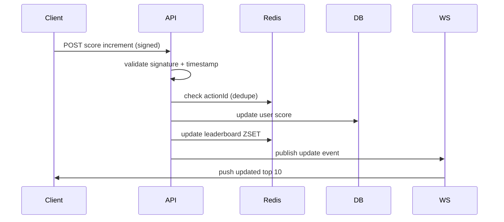

# Problem 6 – Scoreboard Service Project Documentation

## What this service is

This is a small backend service that keeps track of user scores and powers a **live Top 10 leaderboard**.

The idea is simple:

* A user does some action in the product
* The frontend sends a request to the backend saying “this user earned points”
* The backend verifies it (important)
* Score gets updated
* Everyone watching the leaderboard sees updates in real time

The tricky part is not the scoring itself, but:

* preventing fake score increments
* keeping leaderboard fast
* pushing updates live without hammering the database

---

## High-level design

At a high level, I’d split it like this:

* **API Server**

  * receives score update requests
  * validates them properly
  * writes to DB + cache

* **Postgres (source of truth)**

  * stores user scores permanently

* **Redis (fast path)**

  * maintains leaderboard (sorted set)
  * avoids hitting DB for every leaderboard request

* **WebSocket / SSE layer**

  * pushes live leaderboard updates to clients

---

## Score update flow (important part)

This is the actual request lifecycle:

1. User performs an action in frontend
2. Frontend sends a request to backend:

   * includes `userId`
   * includes `actionId`
   * includes signed payload (important)
3. Backend validates:

   * signature is correct
   * request is not expired
   * action wasn’t already used (idempotency check)
4. If valid:

   * increment score in DB
   * update Redis leaderboard
5. Broadcast update event
6. Connected clients get new Top 10 immediately

---

## API

### Increment score

```
POST /api/v1/scores/increment
```

### Request

```json
{
  "userId": "uuid",
  "actionId": "string",
  "timestamp": 1710000000,
  "signature": "HMAC_HASH"
}
```

### Response

```json
{
  "success": true,
  "newScore": 120
}
```

---

## Security (this is the important bit)

If you skip this, the whole system is basically a cheat engine.

### 1. Request signing (HMAC)

Every request must be signed:

```
signature = HMAC(secret, userId + actionId + timestamp)
```

Server recomputes it and compares.

Why:

* prevents fake score injection from random clients
* ensures request came from trusted frontend/backend flow

---

### 2. Replay protection

Each `actionId` can only be used once per user.

Store it in:

* Redis (fast TTL-based)
* or DB unique constraint (safer long-term)

---

### 3. Timestamp window

Reject requests older than ~5 minutes.

Prevents replaying old valid requests.

---

### 4. Rate limiting

Basic protection layer:

* per user: limit score increments/sec
* per IP: global throttling

Nothing fancy, just enough to stop abuse loops.

---

## Data model

### users

```sql
id UUID PRIMARY KEY,
username TEXT,
score INT DEFAULT 0,
updated_at TIMESTAMP
```

### processed_actions

Used for idempotency.

```sql
user_id UUID,
action_id TEXT,
created_at TIMESTAMP,
PRIMARY KEY (user_id, action_id)
```

---

## Leaderboard strategy

Instead of querying DB every time (bad idea under load), Redis handles it.

We use a **Sorted Set**:

### Update score

```
ZINCRBY leaderboard <points> <userId>
```

### Get Top 10

```
ZREVRANGE leaderboard 0 9 WITHSCORES
```

Why this works well:

* O(log N) updates
* super fast reads
* perfect for “Top K” use cases

DB stays the source of truth, Redis is just the fast view.

---

## Real-time updates

When score changes:

* API updates Redis
* then emits an event:

```json
{
  "type": "SCORE_UPDATED",
  "userId": "uuid",
  "score": 120
}
```

WebSocket server listens and pushes updated leaderboard to clients.

---

## Execution flow diagram



---

## Failure handling (real-world stuff)

A few practical things I’d expect in production:

* DB is always the source of truth
* Redis can be rebuilt from DB if needed
* writes should be idempotent (safe retries)
* background retry queue for failed updates

---

## Things I would improve if I had more time

These are not required for the challenge, but good engineering additions:

### 1. Move to event-driven design

Instead of writing directly:

* API → DB → Redis

We could do:

* API → Kafka event → workers update DB/Redis

This improves scaling and decoupling.

---

### 2. Add anomaly detection

Even simple heuristics help:

* sudden score spikes
* repeated action patterns
* abnormal request frequency

Can be flagged for review.

---

### 3. Separate read/write models (CQRS style)

* Write path → Postgres
* Read path → Redis leaderboard

Keeps reads extremely fast.

---

### 4. Observability (often ignored but important)

* structured logs per request
* metrics:

  * score update rate
  * rejected requests (auth failures)
  * Redis latency
* tracing if system grows

---

## Summary

The main idea of this design is:

* DB = truth
* Redis = speed layer
* WebSockets = live updates
* HMAC + idempotency = abuse protection

It’s not over-engineered, but it’s structured in a way that can scale without rewriting everything later.

---
